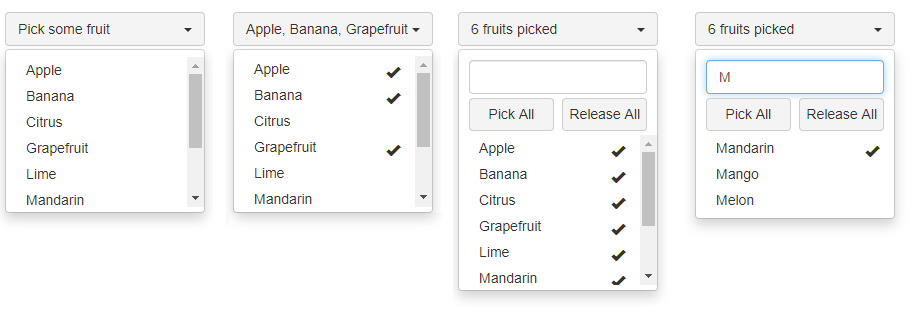

# re-boot-select &middot; [](https://www.npmjs.com/package/@fdefelici/re-boot-select) [](https://travis-ci.org/fdefelici/re-boot-select) [](https://codecov.io/gh/fdefelici/re-boot-select)

Select Component for React based on Bootstrap which offer the following features:
* Single Selection
* Multiple Selection
* Selection Handling
* Search through items
* Scrollbar Control
* Localization 



# Usage
This component is based on React and Bootstrap (only css part), so in your project you must have these dependencies. It's suggested to adopt the following versions:
* react >= 15.0.0
* bootstrap >= 3.3.0

then import the library:
```shell
$ npm install @fdefelici/re-boot-select[@VERSION] --save
```

and use it in your code:
```javascript
import RBS from "@fdefelici/re-boot-select"

...

<RBS.Select
    data={["Apple", "Banana", "Citrus", "Grapefruit"]}
/>
```

> For a full working example take a look [here](example/).

# Configuration
This component allow customization tweeking the following attributes:

| Attribute | Type | Description | Default |
|  ---: | :--- | :---        | :---    |
| `data` | string array | List of items | []  |
| `id` | string | html element ID  | none  |
| `isMultiSelect` | boolean | Allow multiple selection | false  |
| `labels` | object | Localization support (see details in [localization paragraph](#localization-support)) | - |
| `maxItemsAsCaption` | integer | Max number of visible items (comma separated) in caption before showing label message `cap.select.singular` or `cap.select.plural` | 0 |
| `onChange` | function | Callback function called when a selection/deselection happen (see details in the [example](example/)) | none  |
| `showButtons` | boolean | Show Select/Deselect All buttons | false |
| `showSearch` | boolean | Show Search field | false |


## Localization Support
Using ```labels``` attribute it is possible to customize any text the component shows.

| Attribute | Type | Description | Default |
|  ---: | :--- | :---        | :---    |
| `cap.select.empty` | string | Shown when there are no item selected | "Select an item" |
| `cap.select.singular` | string | Shown when just one item is selected, only when `maxItemsAsCaption` is set to 0 | "1 item selected" or same as `cap.select.plural` if only plural attribute is defined. |
| `cap.select.plural` | string | Shown when multiple items are selected, only when the number of selected items is greather than  `maxItemsAsCaption` | "{size} item selected" |
| `btn.select.all` | string | Label for Select All Button | "All" |
| `btn.unselect.all` | string | Label for Unselect All Button | "Clear" |

**Special Markers**

To build labels it's possible to use the follow markers:
* ```{size}```: represent the total number of items
* ```{sel}```: represent the number of items currently selected

**Example**

Example of fully labels customization:
```javascript
<RBS.Select
    ...
    labels={{
        "cap.select.empty": "Select an item",
        "cap.select.singular": "One item selected",
        "cap.select.plural": "{sel} of {size} items selected",
        "btn.select.all": "Pick All",
        "btn.unselect.all": "Release All",
    }}
/>
```

# Browsers Compatibility
This component has been tested against the following browsers:
* Chrome  76+
* Firefox 68+
* Internet Explorer Edge 


# How to Contribute
If you want to contribute to the project, please follow the [guidelines](CONTRIBUTING.md).
