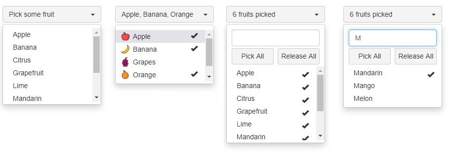
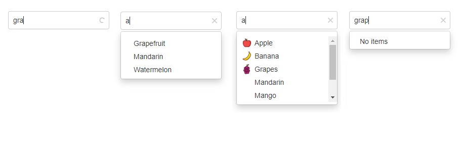

# react-bootstrap-combobox &middot; [](https://www.npmjs.com/package/@fdefelici/react-bootstrap-combobox) [](https://travis-ci.org/fdefelici/react-bootstrap-combobox) [](https://codecov.io/gh/fdefelici/react-bootstrap-combobox) [](https://codesandbox.io/s/github/fdefelici/react-bootstrap-combobox/tree/v1.6.1/example?fontsize=14)

Combobox Components for React based on Bootstrap which offer the following features:

<table><tr>
<td>
<ul>
<li>Single Selection</li>
<li>Multiple Selection</li>
<li>Selection Handling</li>
<li>Search through items</li>
</ul>
</td>
<td>
<ul>
<li>Scrollbar Control</li>
<li>Localization</li>
<li>Item customization</li>
<li>Icon customization</li>
</ul>
</td>
<td>
<ul>
<li>Search Autocompletition</li>
<li>Async data loading</li>
<li>Customizable Callbacks</li>
<li>Enable/Disable behaviour</li>
</ul>
</td>
</tr></table>

This library comes with two flavour widgets: 
* **Select**: smart single/multi selection component
* **Autocomplete**: autocompletion component with single selection

<b>Select showcase</b>


<b>Autocomplete showcase</b>


# Constraints
The library is based on React and Bootstrap (only css part), so in your project you must have these dependencies. It's suggested to adopt the following versions:
* react >= 15.0.0
* bootstrap >= 3.3.0 and < 4.0.0

> Making the library compliant with Bootstrap 4.x is planned. Check-out the [milestone](https://github.com/fdefelici/react-bootstrap-combobox/milestone/11).

# Installation
Import the npm library as usual:
```shell
$ npm install @fdefelici/react-bootstrap-combobox@1.6.1 --save
```

# Usage
Detailed docs, on how to use, configure and tweek the components,can be found here:
* Select widget [guide](README_Select.md).
* Autocomplete widget [guide](README_Autocomplete.md)

# Examples
For a full working example take a look at the [example project](example/) or see the widgets in action at the [live demo](https://codesandbox.io/s/github/fdefelici/react-bootstrap-combobox/tree/v1.6.1/example?fontsize=14).


# Browsers Compatibility
This component has been tested against the following browsers:
* Chrome  76+
* Firefox 68+
* Internet Explorer Edge 

# How to Contribute
If you want to contribute to the project, please follow the [guidelines](CONTRIBUTING.md).
